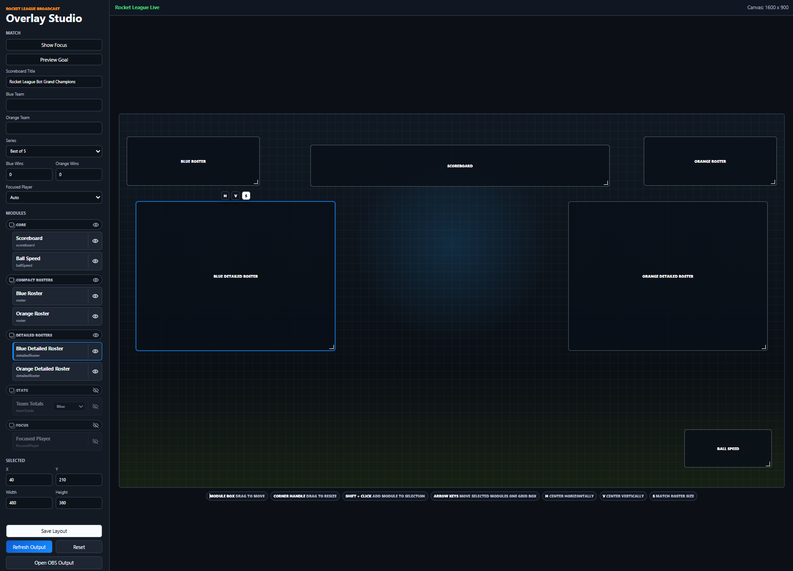
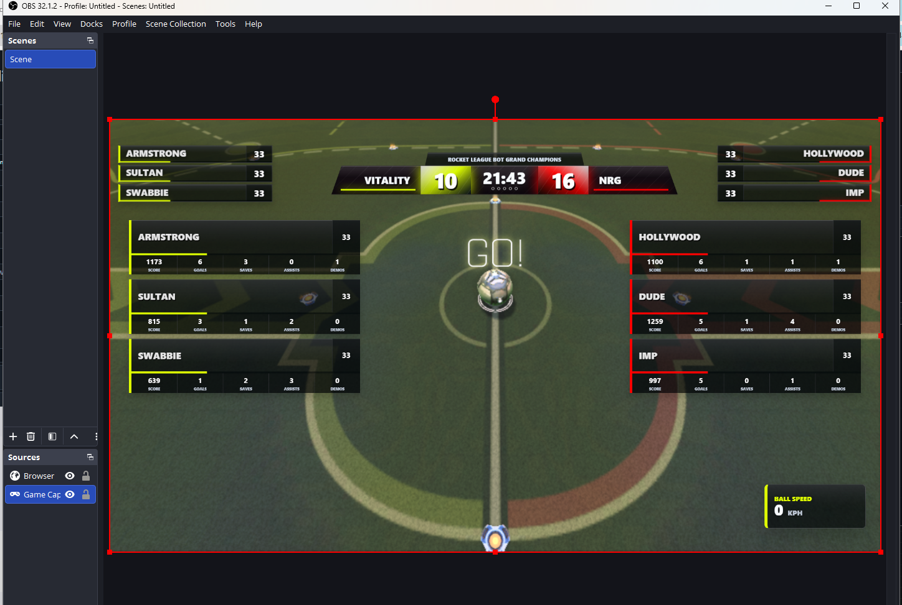
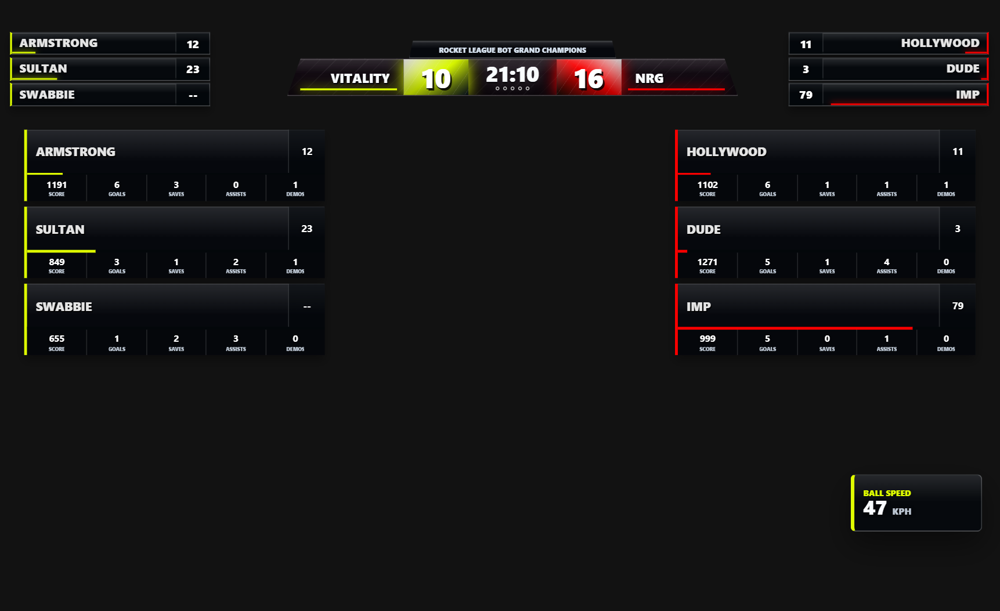

# Rocket League Broadcast Studio 
RLBS - Shoutout SunlessKhan

A local producer-controlled broadcast overlay for Rocket League streams. It reads the Rocket League Stats API, gives a producer a live control panel, and serves a transparent OBS output page.

[Watch the demo on YouTube](https://www.youtube.com/watch?v=7hOhQyc2AQY)

## Features

- Producer panel for live match metadata, module visibility, and layout editing
- Transparent OBS/browser-source output page
- Drag, resize, center, hide, and show overlay modules
- Multi-select movement in the preview canvas with `Shift + click`, drag, and arrow-key nudging
- Scoreboard with team names, scores, game clock, series dots, and optional title bar
- Compact RLCS-style roster modules with player names, boost values, and boost bars
- Separate detailed roster modules with per-player score, goals, saves, assists, and demos
- Team Totals module for one selected team: goals, saves, assists, and demos
- Focused Player lower-third module with producer-selected fallback
- Ball speed badge using last-touch team color
- Automatic goal celebration screen with scorer name and animated module transitions
- Module groups with group-level and individual visibility toggles
- Output refresh command for OBS browser sources
- No npm dependencies

## Screenshots

### Producer View

Use this page outside OBS to control the stream overlay.



### In-Game View

The live Rocket League view with the broadcast overlay in context.



### Overlay Output

Use this transparent page as the OBS Browser Source.



## Requirements

- Rocket League with the Stats API enabled
- Node.js 18 or newer
- OBS, Streamlabs, or another app that supports browser sources

## Rocket League Setup

Before launching Rocket League, edit:

```text
<Rocket League Install Dir>\TAGame\Config\DefaultStatsAPI.ini
```

Set a non-zero packet rate:

```ini
PacketSendRate=30
Port=49123
```

Restart Rocket League after changing this file. The game only reads the Stats API config at startup.

## Quick Start

Install Node.js from:

```text
https://nodejs.org/
```

Then open PowerShell in this project folder and run:

```powershell
npm start
```

Open the producer panel:

```text
http://127.0.0.1:5173/studio.html
```

Add this page as an OBS Browser Source:

```text
http://127.0.0.1:5173/output.html
```

Recommended OBS Browser Source size:

```text
Width: 1600
Height: 900
```

Avoid scaling the browser source up in OBS if possible. Scaling a `1600x900` source to a larger canvas can make text and fine lines look soft. For the sharpest output, keep the browser source at the same size as the overlay stage or update the project stage size to your final broadcast resolution.

## Producer Panel Guide

The producer panel is split into a left control panel and a right preview canvas.

### Match

Use the Match section for stream-level data:

- `Show Focus` / `Hide Focus`: toggles the Focused Player module.
- `Scoreboard Title`: optional title shown above the scoreboard. Leave this blank to hide the title in the output.
- `Blue Team` and `Orange Team`: override team names from the Stats API.
- `Series`: choose best of 3, 5, or 7.
- `Blue Wins` and `Orange Wins`: controls the scoreboard series dots.
- `Focused Player`: choose a fallback player for the Focused Player module. `Auto` lets the overlay prefer the currently spectated player when the Stats API exposes one.

### Modules

Modules are grouped by purpose:

- `Core`: scoreboard and ball speed
- `Compact Rosters`: small RLCS-style name/boost rosters
- `Detailed Rosters`: larger stat-card roster modules
- `Stats`: Team Totals
- `Focus`: Focused Player lower third

Each group has an eye toggle to show or hide the whole group. Each module row also has its own eye toggle for individual visibility.

Hidden modules are removed from the preview canvas so unused modules do not clutter the editor. If you select a hidden module from the list, it appears as a dashed placement ghost so you can edit or reposition it.

The Team Totals row includes a `Blue/Orange` selector in the module list. This chooses which team the Team Totals module highlights.

### Preview Canvas

The preview canvas represents a `1600x900` overlay stage.

- Click a module box to select it.
- Drag a selected module box to move it.
- Drag the bottom-right corner handle to resize it.
- Press the arrow keys to move the highlighted module one grid box at a time.
- `Shift + click` a module box to add or remove it from the highlighted selection.
- Drag any highlighted module to move the selected group together.
- Press the arrow keys with multiple modules highlighted to nudge the whole group one grid box.
- Click the floating `H` button to center the module horizontally.
- Click the floating `V` button to center the module vertically.
- Compact and detailed roster modules include a floating `S` button to match the other roster of the same type.

The same controls are summarized in the legend underneath the preview canvas. The floating `H`, `V`, and `S` buttons appear when a module is selected or hovered; when a module is near the top edge, those buttons appear underneath it so they remain clickable.

Resize is intentionally single-module only.

### Selected

The Selected section shows numeric controls for the primary selected module:

- `X` and `Y`: module position on the 1600x900 stage
- `Width` and `Height`: module dimensions
- `Team`: appears for Team Totals and controls which team is highlighted

When multiple modules are selected, this panel still edits the most recently selected module.

### Actions

- `Save Layout`: immediately saves the current overlay state.
- `Refresh Output`: tells OBS/browser output pages to refresh.
- `Reset`: restores the default layout.
- `Open OBS Output`: opens the transparent output page in a new tab.

Most producer changes auto-save after a short delay. Use `Save Layout` when you want to force a save immediately.

## Overlay Modules

### Scoreboard

Shows team names, current score, game clock, series dots, and an optional title bar. The title is controlled by `Scoreboard Title` in the producer panel and is hidden when blank.

### Compact Rosters

Small side roster modules designed to sit near the scoreboard. They show:

- Player name
- Numeric boost
- Thin horizontal boost bar
- Active/spectated player name highlight when available

### Detailed Rosters

Larger roster modules for stat-heavy moments. Each player card shows:

- Player name
- Boost
- Score
- Goals
- Saves
- Assists
- Demos

These are separate modules from Compact Rosters, so you can hide compact rosters and show detailed rosters only when needed.

### Team Totals

Highlights one selected team and shows:

- Goals
- Saves
- Assists
- Demos

Use the inline Blue/Orange selector in the Modules list to choose the team.

### Focused Player

A lower-third style focused-player module. It prefers the currently spectated player when the Stats API provides that data, then falls back to the producer-selected player.

### Ball Speed

A compact ball speed badge colored by the ball's last-touch team.

### Goal Celebration

When a goal is detected, the normal overlay modules animate out, a large `GOAL` screen animates in with the scoring player name, then the celebration clears after 3 seconds and the regular modules return to their saved positions.

## OBS Setup

Create a Browser Source with:

```text
URL: http://127.0.0.1:5173/output.html
Width: 1600
Height: 900
```

Suggested OBS settings:

- Enable transparency.
- Do not scale the source up if avoidable.
- If the output looks stale after layout changes, click `Refresh Output` in the producer panel.
- If OBS is still stale, right-click the Browser Source and choose **Refresh cache of current page**.

## Project Views

```text
http://127.0.0.1:5173/
```

Simple launcher page.

```text
http://127.0.0.1:5173/studio.html
```

Producer control panel. Use this outside OBS.

```text
http://127.0.0.1:5173/output.html
```

Clean transparent overlay output. Use this in OBS.

## Local State

The producer layout is saved to:

```text
overlay-state.json
```

That file is ignored by git so each producer can keep their own local layout. A starter copy is included as:

```text
overlay-state.example.json
```

To reset from the producer panel, click `Reset`.

## Configuration

The app uses these environment variables:

| Variable | Default | Description |
| --- | --- | --- |
| `PORT` | `5173` | Local HTTP port for Studio and OBS output. |
| `RL_STATS_PORT` | `49123` | Rocket League Stats API port from `DefaultStatsAPI.ini`. |

PowerShell example:

```powershell
$env:PORT=5174
$env:RL_STATS_PORT=49124
npm start
```

## Development

Run syntax checks:

```powershell
npm run check
```

Project files:

- `server.js`: local TCP-to-websocket bridge, static server, and producer-state API
- `studio.html`, `studio.js`, `studio.css`: producer control panel and layout editor
- `output.html`, `output.js`, `output.css`: transparent OBS output
- `overlay-state.example.json`: starter producer layout
- `assets/`: visual assets and README images

## Disclaimer

This project is not affiliated with, endorsed by, or sponsored by Psyonix, Epic Games, or Rocket League. Rocket League is a trademark of its respective owners.
